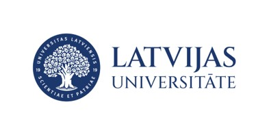
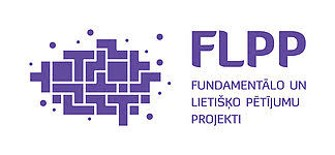

## About

|  |  |
|----------------------------------------|-----------------------------------------|

The data published in this repository were prepared at the Department of Latvian and Baltic Studies, Faculty of Humanities, University of Latvia, as part of the project *Database of Latvian Morphemes and Derivational Models (DLMDM)*, project No. lzp-2022/1-0013, funded by the Latvian Council of Science (2023-2026). Project leader:  Dr. philol. Andra Kalnača, Professor at the Department of Latvian and Baltic Studies, Faculty of Humanities, University of Latvia (andra.kalnaca@lu.lv).

**Database authors:**

Andra Kalnača, Tatjana Pakalne (Editors-in-chief)

Ieva Auziņa, Vanesa Balmane, Anita Butāne, Milan Hoplíček, Daiki Horiguchi, Laura Paula Jansone, Kristīne Levāne‑Petrova, Ilze Lokmane, Paula Miķelsone, Paula Ozola, Inta Urbanoviča.

## DLMDM Registers

This repository contains four linguistic registers produced in the DLMDM project. Each register captures a different layer of derivational morphology data and is provided as a UTF-8 encoded, tab-separated file.

| Register | Description | File path |
|---------|-------------|-----------|
| **Lemma register** | Lexical entries with segmentation, part of speech, morphological features, links to root hierarchies, and parent relations. | `data/lemma_register.tsv` |
| **Root register** | Roots with allomorphs and hierarchical relations, linked to lemmas containing those roots. | `data/root_register.tsv` |
| **Affix register** | Derivational and inflectional affixes with structural and functional information. | `data/affix_register.tsv` |
| **Source register** | Sources of lemmas. | `data/source_register.tsv` |

### Repository layout

- `data/` — the four registers.
- `docs/` — project overview and data model description.
- `docs/examples/` — examples of isolated word families as encoded in the registers, with visualizations.
- `CHANGELOG.md` — version history.
- `LICENSE` — usage and redistribution terms.
- `README.md` — project description and usage notes.

### Versioning

The dataset follows semantic versioning:

- **Major** — structural changes, e.g., `0.9.0 -> 1.0.0`.
- **Minor** — new entries or expanded coverage, e.g., `1.0.0 -> 1.1.0`
- **Patch** — corrections, cleanup, or minor fixes, e.g., `1.1.0 -> 1.1.1`.

The version history and the current version are stored in the `CHANGELOG.md` file.

### Citation

If you use these registers in research, please cite the DLMDM project.
