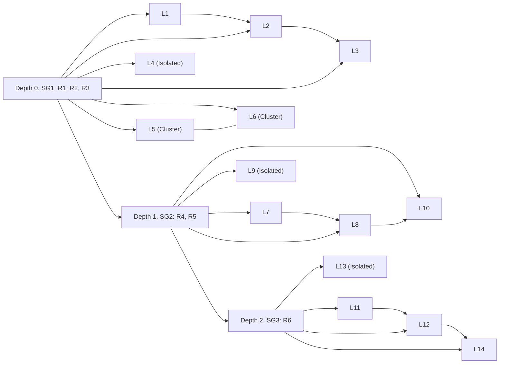

# DLMDM Registers: Overview

The DLMDM registers provide structured morphological information on lemmas included in the database. They are designed for:

- linguistic analysis,
- morphological modelling,
- lexicon building,
- visualization of derivational and root hierarchies.

The registers are updated periodically. See `CHANGELOG.md` for version history.

This document explains the linguistic notation used in the database and outlines the general principles behind its design.

--------------
The "Database of Latvian Morphemes and Derivational Models" is a manually validated corpus-based database developed at the Department of Latvian and Baltic Studies, Faculty of Humanities, University of Latvia. DLMDM was built using a bottom-up approach, in which the data model, tagsets, etc. were developed gradually from the actual complexity of empirical data. This included several stages: morphemic segmentation of lemmas; assignment of lemmas to root entities (subgroups, `SGs`), which required resolution of root allomorphy and homonymy; construction of root hierarchies (word families, `WFs`); and, finally, definition of derivational relations between lemmas within `SGs`.

Derivational relations, i.e. means of word formation, the source word(s), and the underlying derivational models/constructions are currently defined from a **structural** perspective, i.e. the collective language system as it exists and evolves through time. Synchronic word-formation routes available to contemporary speakers  (the cognitive perspective) belong to a different layer of abstraction, which may be implemented later as an additional data layer. The collective-structural and the individual-synchronic perspectives are viewed as mutually complementary where one enables the other.

The initial core of the database for the first and second stages was formed by importing all lemmas from the "Balanced Corpus of Modern Latvian (LVK2018)". In later stages, additional lemmas were added from other sources to improve coverage within `SGs` (see `source_register.tsv` for references).

The resulting data architecture can be conceptualized as a multi-layered hybrid graph:

1. Overarching Directed WF Graph. At the highest level, morphologically and etymologically related lexical roots are organized into a directed graph (a word family, `WF`), where each node (a subgroup, `SG`) represents either a root entity (all allomorphs of a root), or a zero-element placeholder - for sibling `SGs` that are descendants of a common ancestor (often, a PIE root). Root entities are hierarchically linked, with depth indicating inheritance and formal complexity. Organizing roots into hierarchies and linking them to lemmas allows word families across strata (borrowed and inherited) and enables flexibility in defining structural derivational relations, i.e. a lemma may lack a source word but still be a member of a `SG` and a `WF`.

2. Directed Root-Centered Subgraphs. Each root entity governs a local domain of lemmas, forming a directed root-->lemmas subgraph. Lemmas having more than one root (e.g., compounds, hybrid formations) are assigned to multiple `SGs` and `WFs`.

3. Nested Derivational Structures. Local domains of lemmas typically contain one or several derivational subgraphs. These subgraphs encode structural derivational pathways. Some lemmas within local domains are isolated, linked only to the root entity. These may be borrowings or words with unclear or non-transparent derivational history. Local domains may also host clusters - lemmas that share semantic affinity and etymological origin but do not stand in a derivational relationship, e.g., `klasificēt ‘to classify’`, `klasifikācija ‘classification’`, and `klasifikators ‘classifier’` would form a cluster, because they share root identity and semantic relatedness, which is not supported by structural segmentability within Latvian derivational morphology.

Visualizations of hybrid graphs are avaialable at `docs/examples`.

Lemmas and morphemes are stored as discrete, uniquely identified entities, with feature-based annotations for grammatical, morphological, and motivational attributes.

## Annotation Scheme

This section defines the markup tags used throughout the `TSV` data. These tags also appear among placeholders in `README_fields.md` when describing allowed field values, and as keys in lookup tables in the conceptual relational model (`data_model.md`).

## `POS` (Part of speech in UD format)

| Part of speech | Tag | Example |
| --- | ------ | --------- |
| Common noun | NOUN | `galds`, `alfabēts` |
| Proper noun | PROPN | `Edgars`, `Edžus`, `Bērzezers` |
| Adjective | ADJ | `labs`, `priecīgs`, `bezbēdīgs` |
| Adverb | ADV | `apcerīgi` |
| Verb | VERB | `apcirst` |
| Interjection | INTJ | `ehē`, `adjē` |
| Pronoun | PRON | `cits` |
| Numeral | NUM | `pieci`, `divdesmit` |
| Adposition | ADP | `uz`, `dēļ` |
| Particle | PART | `ik`, `pat`, `nez` |
| Coordinating conjunction | CCONJ | `un`, `bet` |
| Subordinating conjunction | SCONJ | `ka`, `ja` |
| Genitive nouns derived from participles (i.e. verbs) | OTHER | `caurviju` |

## `FEATS` (Morphological features)

`FEATS` values are POS-specific

| POS | FEATS | Description | Example |
| --- | ----- | ------ | --------------- |
| NOUN | NounClass=Gen | Genitive nouns | `piecgraudu`, `bezgala` |
| NOUN | NounClass=Indecl | Indeclinable common nouns | `domino`, `brīnumauto` |
| NOUN | NounClass=PlTantum | Common nouns that occur only in the plural (pluralia tantum) | `dūmi`, `nogulsnes`, `saulgrieži` |
| PROPN | PropnClass=Indecl | Indeclinable proper nouns | `Līgo`, `Eduardo`, `Būvenergo` |
| PROPN | PropnClass=PlTantum | Proper nouns that occur only in the plural | `Talsi`, `Mežgaļi`, `Lieldienas` |
| NUM | NumeralClass=Gen | Genitive numerals | `daudzmiljonu` |
| NUM | NumeralClass=Indecl | Indeclinable numerals | `desmit`, `simt`, `divtūkstoš` |
| NUM | NumeralClass=PlTantum | Numerals that occur only in the plural | `divi`, `seši`, `trejdeviņi` |
| ADJ | AdjectiveClass=Indecl | Indeclinable adjectives | `lillā`, `bālrozā` |
| ADJ | AdjectiveClass=Propn | Adjectives used in proper name function | `Garais`, `Visuaugstais` |
| VERB | VerbForm=Part | Participles | `dziedējošs`, `neapdzīvots`, `jaundzimis` |
| VERB | VerbForm=Part,PartClass=Propn | Participles used in proper name function | `Visvedošais` |
| OTHER | OtherClass=Gen | Deverbal genitives (genitive nouns derived from participles) with POS value OTHER | `piespiedu`, `pusauga` |

## `WFTYPE` (Means of word formation)

The database uses a custom tagset for means of word formation, developed to reflect the empirical data.

| WFTYPE | Description | Example | Method of word formation |
| -------------- | ----------- | ------- | ------------------------------------- |
| `DERIV` | Affixation, or affixation combined with sound alternation | `darītājs`, `svārstīt` (from `svērt`), `ceļš` (from `celt`) | Morphological |
| `MORPHON` | Morphophonological word formation: the only means is sound alternation | `jukt – jaukt`,  `brukt – braukt` | Morphological |
| `COMP` | Compounding | `baltegle`, `grīdsega` | Syntactic |
| `HYBR` | Hybrid words and neoclassical formations | `būvatļauja`, `biokomponente` | Unclassified |
| `SEMANT` | Pluralia tantum, various cases of conversion and proper name formation that do not fit other categories | `balti` 'Baltic peoples', `svari` 'scales', `mājās` (ADV), `Ābols` (PROPN) | Semantic |
| `LOANTR` | Loan translations | `daudzfunkcionāls`, `līdzautors`, `dzimtbūšana` | Unclassified |
| `OTHER` | Means not included in other categories: clipped words, blends, phrasal or pseudo- compounds, abbreviations, etc. | `paldies`, `re`, `nez`, `velnsviņuzinakāds` | Unclassified |
| `NONE` | Primary (non-derived) words and words borrowed as whole units | `augt`, `lapa`, `mazs`, `treniņš`, `balets`, `klasifikācija` | N/A |

## Other fields relevant to word-formation relations

| Field | Description | Example |
| -------- | ----------- | ----------- |
| `WFCONSTR` | Syntactic construction underlying the compound; the field may contain multiple alternative constructions separated by a semicolon. Each construction is in double quotes. | `"autora atlīdzība"`, `"ābolu diena"`, `"baltas astes";"baltu asti"`; `"bērna istaba";"bērnu istaba"` |
| `PARENTFORM` | Manually defined source word(s) of the lemma, encoded as sets with `WFTYPE`-dependent structure. If multiple sets are provided, they are delimited by a semicolon and represent alternative interpretations of the word-formation path. | `dežūra+ārsts;dežurējošs+ārsts`, `bārstīties;izbārstīt` |
| `PARENTID`, `PARENTRES` | Fields that resolve the source-word sets defined in `PARENTFORM` to actual parent lemmas listed in the database (for details, see `README_fields.md`). | `COMP:L991+bjefs`, `COMP:auto+UNR` |
| `WFPHON` | Notes on sound change involved in the specific word-formation operation. Written in free form. | `bļāva` (for `bļāvējs` from `bļaut`), `sunpurnis` (for `sumpurnis`) |
| `SEGMENTATION` | Morphemic segmentation of the lemma. Affixes are delimited from neighbouring morphemes by a hypen, roots are enclosed in parentheses. Segmentation is performed from a diachronic perspective. Units are segmented only to the extent supported by Latvian morphology. | `(jūr)-a`, `aiz-(skrie)-t`, `(brīv)-(gā)-j-ien-s`, `(ķirbj)-(aug)-s`, `(koncert)-(dzī)-v-e` |
